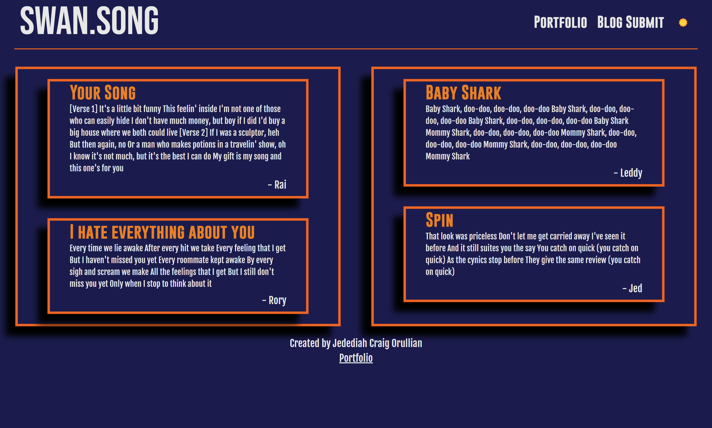

# Orullian-Swan-Song-Module-4-Challenge

[Link to Form](https://jorullian.github.io/orullian-swan-song-module-4-challenge/)
[Link to Blog](https://jorullian.github.io/orullian-swan-song-module-4-challenge/blog.html)

.png)

## Description
This is a personal blog that will allow the user to catalog songs, links and descriptions of what they liked about specific songs. The blog will store the 10 most recent blog posts that are input thru the index.html which acts as the hub and form input page.  The form includes inputs for user name, song name, song url and an explanation of why that song impacted them during that listening. The nav bar on both the form input and blog pages allow movement between both pages to allow easily repeatable input. Form input data is stored in localStorage and shared between pages so after submitting form data, the data will populate the blog page.

I have a deep appreciation of music and songs have different meanings for me at different stages of my life. I created this blog to be able to keep track of the impact songs had on me in recent history. This project is also a foundation for a potentially larger project where the site can act like a community blog/forum and users can see other people's blog posts and see what they wrote about those songs. Additionally I would like to implement various API's to be able to call data from larger music databases such as Spotify, Apple music or YouTube. The APIs will autopopulate the blog post with song names, album art and other information.

The key to this simple blog is how form input data is stored in localStorage and recalled on the blog page side. One problem I ran into was that any time I refreshed the index.html page, any future input overwrote the blogPosts array and would eliminate previous inputs. I realized that my issue was that I needed to retrieve the array from localStorage on the index.html page side which would get the array ready for new inputs and not overwrite previous data. 

## Citations
### Color Palettes
[Veiva Color Palette](https://www.color-hex.com/color-palette/1047352)

### Images
[Album Art](https://www.billboard.com/photos/best-album-covers-of-all-time-6715351/98-3-patti-smith-horses-1975-album-art-billboard-1240/)

### API
JQuery

## Closing

All code is original and written by Jedediah Craig Orullian.

This project is part of an ongoing coding bootcamp.